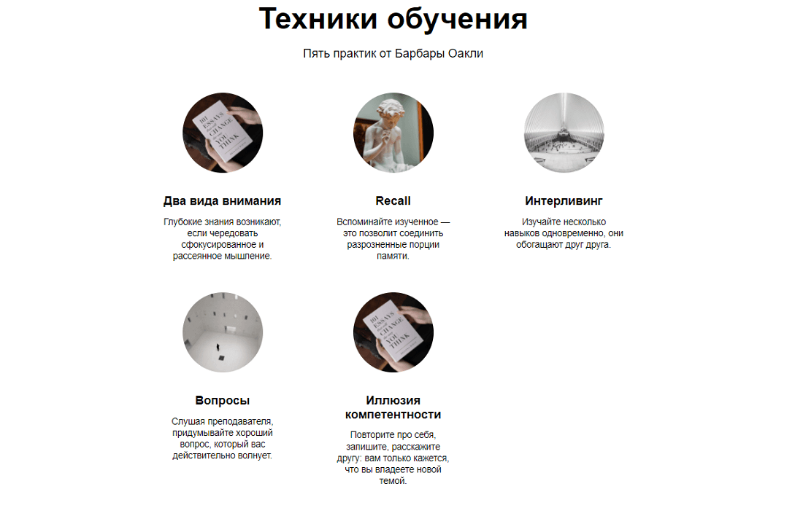
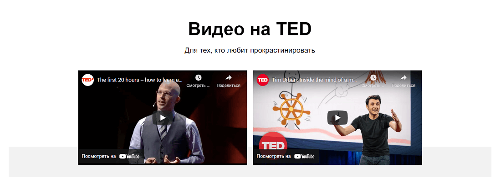
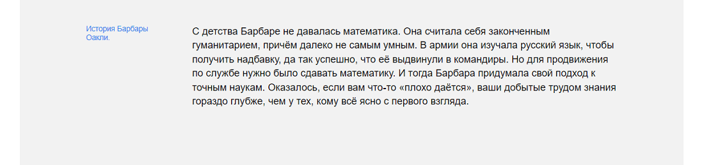
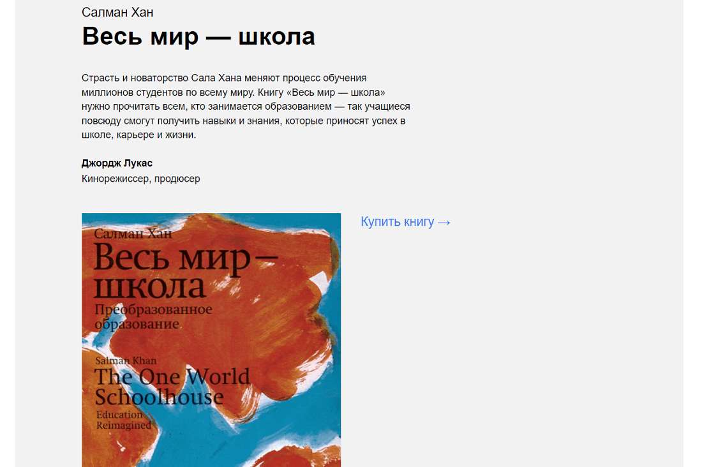
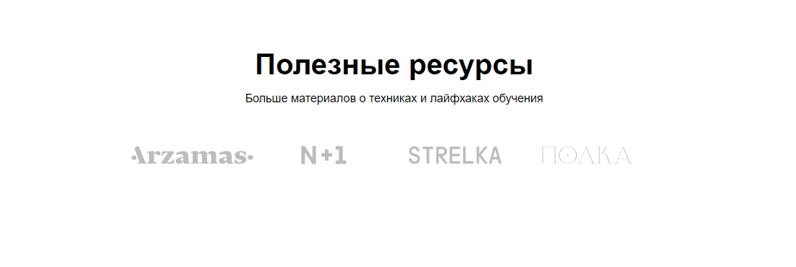
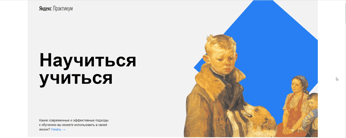
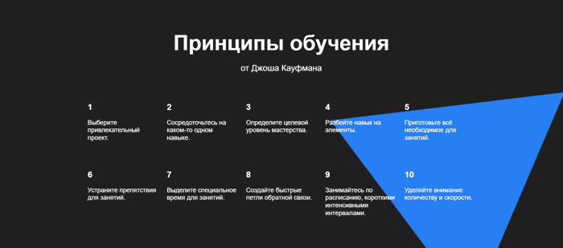
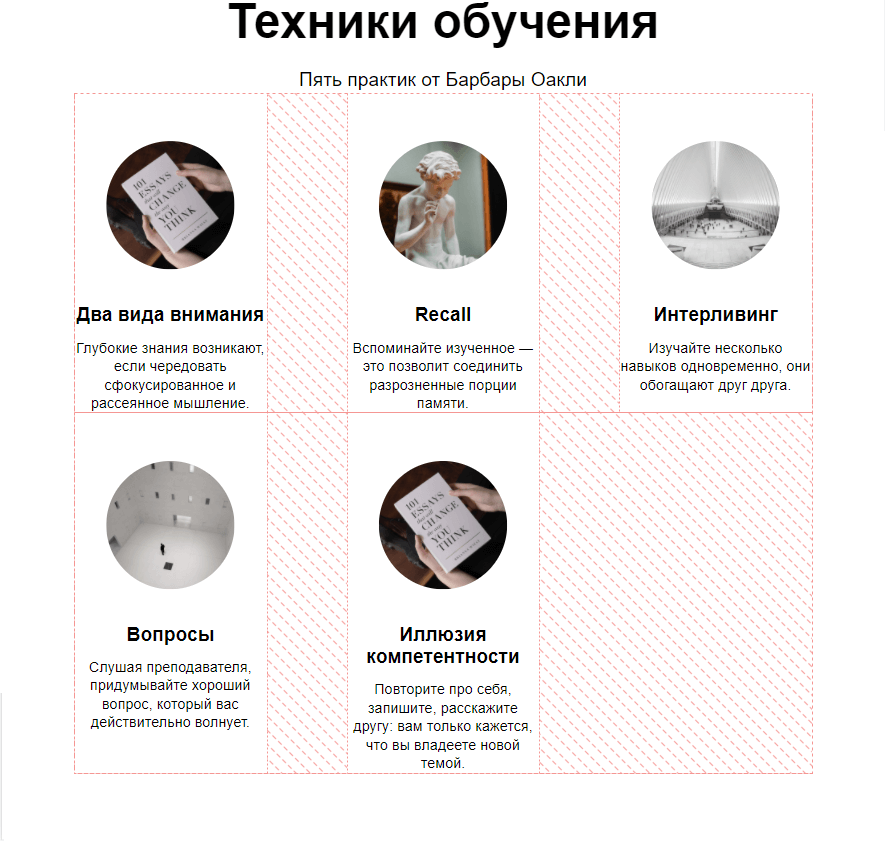

# Лендинг Научиться учиться. #
---

## О проекте

Проектная работа представляет собой одностраничный сайт

---

## Стек #
* HTML
* CSS

---

## Отличия от первой проектной работы

---

### Добавлены новые секции
*  _techniques_

---
*  _video_

---
*  _oakley_

---
*  _khan_

*  _resources_

---

## Технологии
---
* Верстка Flexbox
* gap
* CSS анимации
* Применение БЭМ методолгии , а так же файловой структуры БЭМ Nested
* Применение элемента  iframe

### Примеры анимации

---

---

### Пример Flexbox и gap

---

## Планы по доработке
---
* Адаптировать сайт под различные устройства
* Добавить форму обратной связи
* Подклдючить дополнительные шрифты
* Дописать вендорные перфиксы
* Добавить образовательные видео

